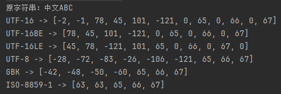

# Java异步编程

## 概述

允许程序在等待某个任务完成的同时，不阻塞主线程（或主流程），而是去执行其他任务。

## 学习样例

### 同步任务

```
//假设这个任务需要2秒执行
try {
    TimeUnit.SECONDS.sleep(2);
} catch (InterruptedException e) {
    throw new RuntimeException(e);
}
String s = "Hello";
System.out.println(Thread.currentThread().getName() + " 执行任务");

System.out.println("main线程等待结果...");
System.out.println("结果 = " + s);
```

执行结果如下

<div align="left"><figure><figcaption></figcaption></figure></div>

我们的主线程只会一直等待任务处理完毕才能继续进行下一步，所以打印的main执行任务。

### 主线程等待异步结果

```
CompletableFuture<String> future =
    CompletableFuture.supplyAsync(() -> {
        try {
            TimeUnit.SECONDS.sleep(2);
        } catch (InterruptedException e) {
            throw new RuntimeException(e);
        }
        System.out.println(Thread.currentThread().getName() + " 执行任务");
        return "Hello";
    });

System.out.println("main线程等待结果...");
String result = future.get();
System.out.println("结果 = " + result);
```

异步执行任务，然后通过get方法获取到异步任务的执行结果，get方法会阻塞当前线程，执行结果如下

<div align="left"><figure><figcaption></figcaption></figure></div>

我们的主线程先打印的main线程等待结果，这一步就可以去执行别的任务了。

### 指定异步任务执行的线程池

```
ExecutorService executor = Executors.newFixedThreadPool(2);

CompletableFuture<String> future = CompletableFuture.supplyAsync(() -> {
    System.out.println(Thread.currentThread().getName() + " 执行任务");
    return "Data from task";
}, executor);

System.out.println("main 等待结果...");
System.out.println("结果 = " + future.get());

executor.shutdown();
```

执行结果如下

<div align="left"><figure><figcaption></figcaption></figure></div>

这个时候我们发现这个任务是通过我们构建的executor 线程池去跑的

### 异步任务配置和执行

```
CompletableFuture<Void> future = CompletableFuture
            .supplyAsync(() -> {
//                try {
//                    TimeUnit.SECONDS.sleep(2);
//                } catch (InterruptedException e) {
//                    e.printStackTrace();
//                }
                System.out.println(Thread.currentThread().getName() + " supplyAsync 执行");
                return "Hello";
            })
            .thenApply(s -> {
                System.out.println(Thread.currentThread().getName() + " thenApply 执行");
                return s + " World";
            })
            .thenAccept(s -> {
                System.out.println(Thread.currentThread().getName() + " thenAccept 执行");
                System.out.println("结果：" + s);
            })
            .thenRun(() -> {
                System.out.println(Thread.currentThread().getName() + " thenRun 执行");
            });

        future.get(); // 阻塞等待完成
```

执行结果如下

<div align="left"><figure><figcaption></figcaption></figure></div>

打开注释然后执行，获取到的执行结果

<div align="left"><figure><figcaption></figcaption></figure></div>

不同的点在于thenApply、thenAccept、thenRun对应的回调方法的执行位置。

#### 说明

如果前一个任务「已经完成」，那么注册回调的线程（可能是 main）立刻执行；避免额外线程切换的开销。

如果前一个任务「还没完成」，那回调就会被保存起来，等异步线程执行完后触发；

谁触发 complete()（也就是任务完成），谁就执行下一个阶段。

### 异步执行

```
CompletableFuture<String> future = CompletableFuture
    .supplyAsync(() -> {
        System.out.println(Thread.currentThread().getName() + " supplyAsync 执行");
        return "Hello";
    })
    .thenApplyAsync(s -> {
        System.out.println(Thread.currentThread().getName() + " thenApplyAsync 执行");
        return s + " Async World";
    });

System.out.println("结果：" + future.get());
```

执行结果

<div align="left"><figure><figcaption></figcaption></figure></div>

我们发现都是提交到线程池去执行的，不会存在上一个案例里面，有主线程执行的情况。

那为什么要有 thenApplyAsync因为有时候你希望一定在异步线程中执行，比如：

* 耗时操作（I/O、网络）
* 不想阻塞 main 或业务线程

### 异常处理

```
CompletableFuture<String> future = CompletableFuture
    .supplyAsync(() -> {
        System.out.println(Thread.currentThread().getName() + " 执行任务");
        if (true) throw new RuntimeException("出错啦");
        return "OK";
    })
    .exceptionally(ex -> {
        System.out.println("捕获异常: " + ex.getMessage());
        return "默认值";
    });

System.out.println("结果：" + future.get());
```

执行结果

<div align="left"><figure><figcaption></figcaption></figure></div>

### thenCompose方法

```
CompletableFuture<String> future = CompletableFuture
    .supplyAsync(() -> {
        System.out.println(Thread.currentThread().getName() + " 获取用户ID");
        return "User123";
    })
    .thenCompose(userId -> CompletableFuture.supplyAsync(() -> {
        System.out.println(Thread.currentThread().getName() + " 根据 " + userId + " 查询用户信息");
        return "用户信息：" + userId;
    }));

System.out.println("结果：" + future.get());
```

执行结果

<div align="left"><figure><figcaption></figcaption></figure></div>


### 手动构建

```
// 手动创建一个 CompletableFuture（此时是空的，没有任务）
CompletableFuture<String> future = new CompletableFuture<>();

// 注册回调 —— 注意，这个阶段不会立即执行，因为还没有 complete()
future.thenApply(result -> {
    System.out.println(Thread.currentThread().getName() + " 执行 thenApply，收到结果：" + result);
    return result + " World";
}).thenAccept(result -> {
    System.out.println(Thread.currentThread().getName() + " 执行 thenAccept，最终结果：" + result);
});

// 模拟异步线程在后台计算结果
new Thread(() -> {
    try {
        System.out.println(Thread.currentThread().getName() + " 开始计算任务...");
        Thread.sleep(1000); // 模拟耗时
        // 任务完成后，手动触发 complete
        future.complete("Hello");
        System.out.println(Thread.currentThread().getName() + " 调用了 complete()");
    } catch (InterruptedException e) {
        e.printStackTrace();
    }
}, "Worker-Thread").start();

// 阻塞等待所有完成
Thread.sleep(2000);
System.out.println(Thread.currentThread().getName() + " 主线程结束");
```

执行结果

<div align="left"><figure><figcaption></figcaption></figure></div>

### 为什么需要手动构建


