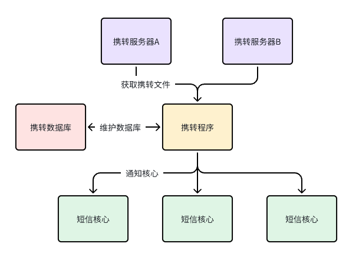
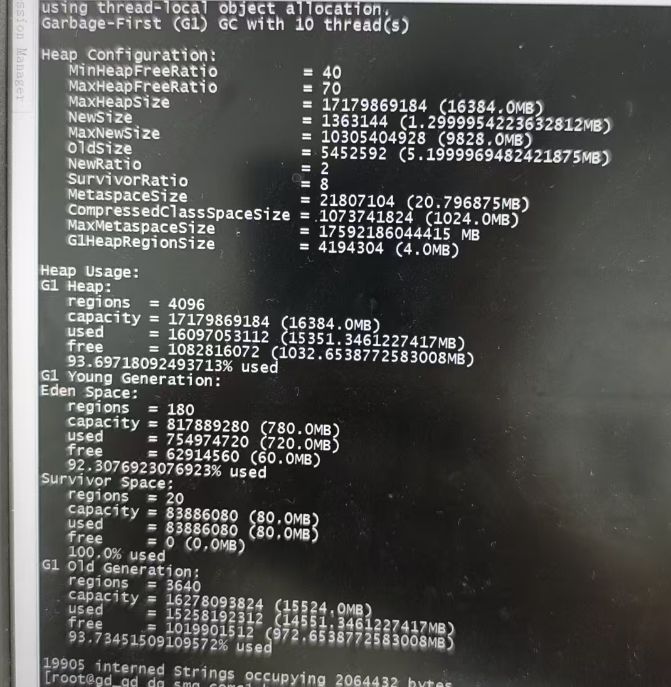
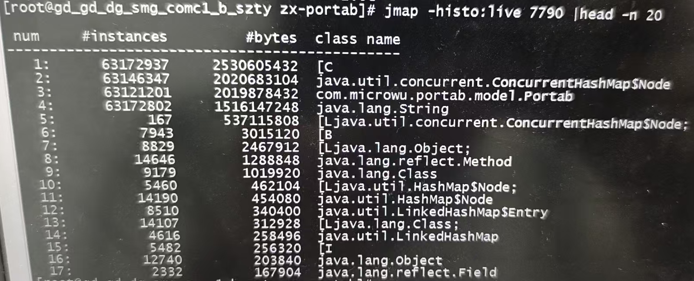

# 记录一次线上调优问题

## 场景

线上携号转网，包含联通移动电信总将近1.2亿条，设计携号转网内存的时候，只提供了1.2亿条的数据量上限，携转数据即将产生问题（新数据会丢弃）

## 目标

删除移动电信携转数据，只保留联通携转数据，将近6500W条数据

## 测试过程遇到的其他问题

问题1：全量数据一次性加载到内存，流速处理不生效

问题2：线上内存吃紧，代码当中发现可以去除掉的字段

## 线上流程图

<figure><figcaption></figcaption></figure>

## 问题1

线上携号转网程序加载数据库数据到内存当中，未使用流式加载，导致数据一次性读取到系统

### 问题复现

模拟数据库数据大小如下

<figure><figcaption></figcaption></figure>

线上采用代码如下

<figure><figcaption></figcaption></figure>

测试代码如下，如果数据大于40W，就睡眠一下，然后打印当前内存数据

<figure><figcaption></figcaption></figure>

线上内存数据图，我们发现有很多ByteArrayRow实例，数据库读取数据的实例

<figure><figcaption></figcaption></figure>

修改数据库读取方式为流式读取

<figure><figcaption></figcaption></figure>

打印的内存结果如下，我们发现并没有全量加载数据库数据，符合流速读取

<figure><figcaption></figcaption></figure>

## 问题2

携号转网对象存在未使用的字符串数据，浪费内存

测试服加载6300W数据，大概要费14G的内存数据量

<figure><figcaption></figcaption></figure>

<figure><figcaption></figcaption></figure>

然后将字段设置为null后，只占用8G内存

<figure><figcaption></figcaption></figure>

<figure><figcaption></figcaption></figure>
