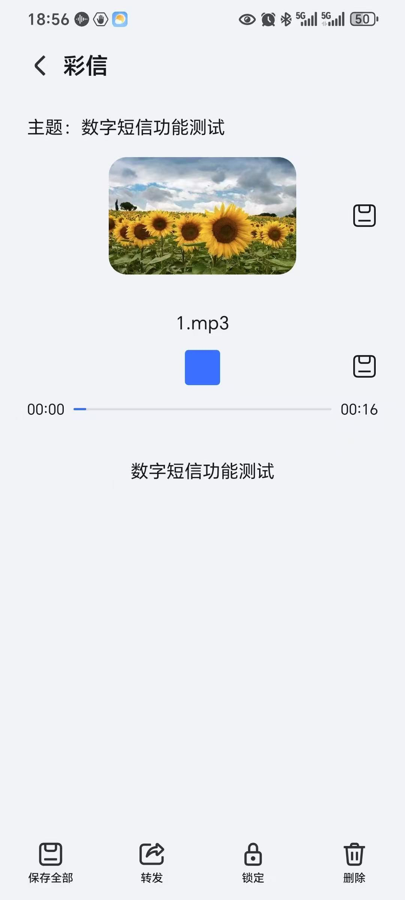

# 数字短信架构设计

## 架构图

<figure><figcaption></figcaption></figure>

## 整体说明

所有模块支持横向扩展，最大下载量受限于于数字短信包大小和网络带宽

## 模块说明

数字短信管理平台：负责维护账号数据、接入号数据、模板数据、素材文件数据、认证IP数据、统计报表、话单查询等

数字短信下发程序：负责加载账号数据、接入号数据、模板数据等基础业务数据、构造WAP短信，对接短信中心，维护消息内存数据，下发WAP短信，接收短信状态报告，回调消息写入消息队列，下载数据写入Redis。

数字短信下载程序：接收终端下载请求，拉取MinIO素材文件，构造数字短信，回调消息写入消息队列。

数字短信回调程序：消费消息队列数据、构造HTTP请求通知业务方。

短信网关：WAP短信下发通道

## 模板示例

<figure><figcaption></figcaption></figure>

## 安卓终端展示结果

<figure><figcaption></figcaption></figure>

## &#x20;苹果终端展示结果

<figure><figcaption></figcaption></figure>
